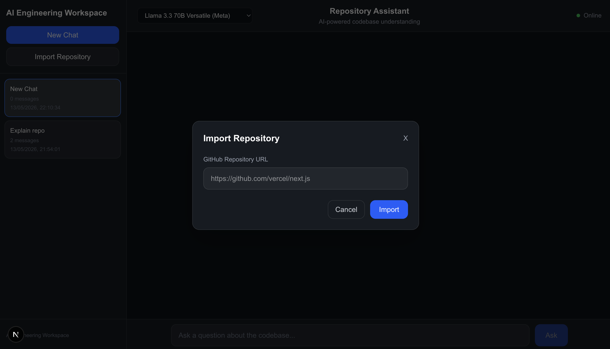
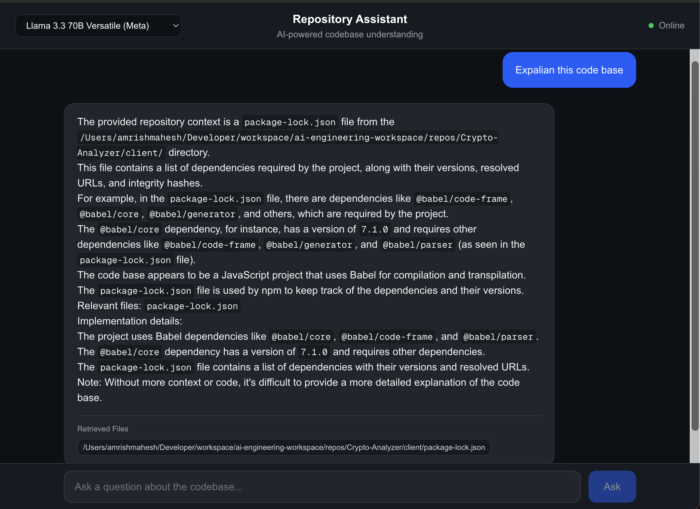
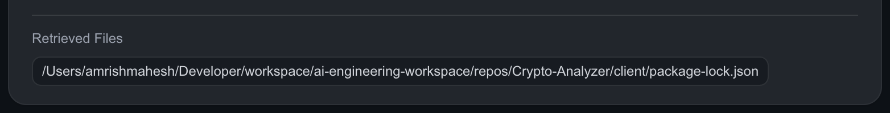
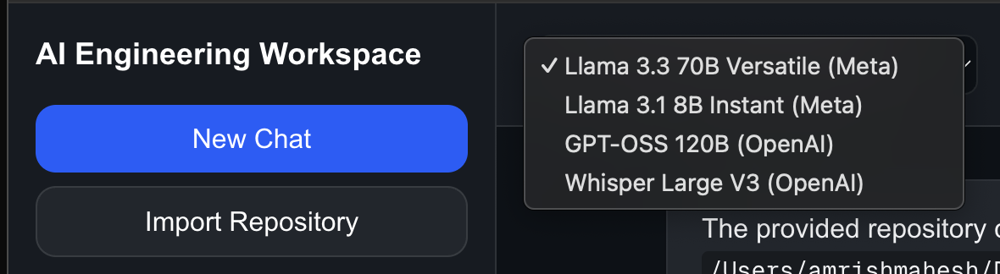
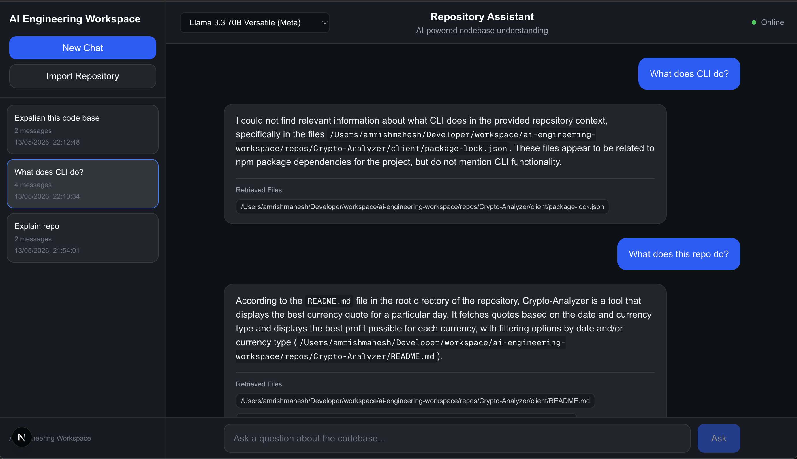

# AI Engineering Workspace

<p align="center">
  
  
  
  
  
</p>

An AI-native developer platform for understanding, indexing, and interacting with codebases using LLMs, semantic search, and intelligent engineering workflows.

## Overview

AI Engineering Workspace is a modern RAG-powered platform that enables developers to:

- Chat with repositories using AI
- Understand architecture flows through semantic search
- Perform intelligent code analysis
- Generate implementation insights
- Analyze engineering systems using AI-powered tools

This project focuses on building production-style AI infrastructure and developer tooling workflows.

## Demo

### AI Repository Chat

> Import a GitHub repository, generate embeddings, perform semantic retrieval, and chat with the codebase using AI.

### Screenshots

- Repository import modal
  
- AI repository chat
  
- Retrieved context UI
  
- Model switching
  
- Multi-session workspace sidebar
  

### Loom Demo

<div>
    <a href="https://www.loom.com/share/0313dce968e04906a7cf1d63f24cbfc6">
      <p>Repository Assistant - 13 May 2026 - Watch Video</p>
    </a>
    <a href="https://www.loom.com/share/0313dce968e04906a7cf1d63f24cbfc6">
      
    </a>
  </div>

---

# Repository RAG Architecture

```text
GitHub Repository
        ↓
Repository Ingestion
        ↓
File Chunking
        ↓
Embedding Generation
        ↓
PostgreSQL + pgvector
        ↓
Semantic Retrieval
        ↓
Context Injection
        ↓
LLM Response Streaming
        ↓
AI Repository Chat
```

This project explores end-to-end Retrieval-Augmented Generation (RAG) workflows for developer tooling and repository intelligence.

---

# Features

## Current

- **Next.js App Router architecture** with TypeScript
- **AI API integration** using Groq + Llama 3.3 70B
- **Repository-aware AI chat** with streaming responses
- **Multi-session AI workspace** with persistent conversations
- **GitHub repository import pipeline** for public repositories
- **Repository ingestion pipeline** with automated file scanning and chunking
- **Embedding generation** using Xenova/all-MiniLM-L6-v2
- **Vector database integration** using PostgreSQL + pgvector
- **Semantic repository retrieval** using cosine similarity search
- **RAG-powered contextual AI responses** grounded in repository code
- **Interactive chat UI** with sidebar sessions and dark mode workspace layout
- **Streaming AI responses** with incremental rendering
- **Reusable frontend architecture** using hooks, services, and modular components
- **Docker infrastructure** for local AI development
- **Semantic search infrastructure** for code understanding workflows
- **Retrieved context UI** showing semantic source files used for responses
- **Dynamic AI model switching** for experimentation and performance tuning
- **Repository-grounded response generation** with source-aware retrieval

## Planned

- Architecture visualization
- PR review assistant
- Repository summarization
- Multi-agent engineering workflows
- GitHub OAuth & private repository support
- Evaluation & observability systems
- Code generation workflows
- Agentic developer tooling

---

# Tech Stack

## Frontend

- Next.js 16 (App Router)
- React 19
- TypeScript
- TailwindCSS
- React Markdown & Syntax Highlighting

## Backend

- Node.js
- Next.js API Route Handlers
- PostgreSQL with pgvector
- Drizzle ORM
- Streaming AI response pipelines

## AI Infrastructure

- Groq API (Llama 3.3 70B)
- OpenAI-compatible SDKs
- Xenova/all-MiniLM-L6-v2 embeddings (384 dimensions)
- RAG architecture with semantic retrieval
- Cosine similarity for vector matching

## Infrastructure

- Docker & Docker Compose
- PostgreSQL vector database
- Local development setup

---

# Architecture Goals

This project explores modern AI engineering concepts including:

- Retrieval-Augmented Generation (RAG) for codebase understanding
- Codebase ingestion and chunking pipelines
- Semantic search and vector similarity
- Context engineering for AI interactions
- AI workflow orchestration
- Repository-aware conversational interfaces
- GitHub ingestion and indexing systems
- Vector retrieval pipelines for code intelligence
- Streaming AI UX patterns
- AI-native developer workspace design
- Developer productivity tooling
- Real-time streaming AI responses

---

# Project Status

🚧 Active Development

Current phase: End-to-end repository RAG system with GitHub ingestion, pgvector retrieval, semantic repository chat, and AI workspace UX.

---

# Local Development

## Prerequisites

- Node.js 18+
- Docker & Docker Compose
- Git

## Setup

1. **Clone the repository**

   ```bash
   git clone <repository-url>
   cd ai-engineering-workspace
   ```

2. **Install dependencies**

   ```bash
   pnpm install
   ```

3. **Start PostgreSQL database**

   ```bash
   docker compose up -d
   ```

4. **Start the development server**

   ```bash
   pnpm run dev
   ```

5. **Import a GitHub repository**

   Open:

   ```
   http://localhost:3000/chat
   ```

   Then use the `Import Repository` modal to ingest and index a public GitHub repository.

---

# API Endpoints

- `POST /api/import-repo` - Clone, chunk, embed, and index GitHub repositories
- `GET /api/repo-chat` - Repository-aware AI chat with semantic retrieval

---

# Example Workflow

1. Import a public GitHub repository
2. Repository files are scanned and chunked
3. Embeddings are generated and stored in pgvector
4. User asks repository questions through AI chat
5. Semantic retrieval finds relevant repository context
6. Context is injected into the LLM prompt
7. AI streams grounded responses with retrieved sources

---

# Future Improvements

- Repository-scoped vector retrieval
- Background ingestion workers
- Hybrid search + reranking
- Multi-repository workspaces
- Architecture-aware chunking
- Agentic engineering workflows
- AI pull request reviews
- Repository memory systems

---

# Vision

The long-term vision is to build an AI-native engineering workspace capable of understanding repositories, retrieving relevant architectural context, assisting developers through intelligent workflows, and evolving toward autonomous AI engineering systems.

This project explores the future of developer tooling through retrieval-augmented generation (RAG), semantic code understanding, repository intelligence, and AI-first engineering experiences. The goal is to evolve toward production-grade AI engineering systems capable of semantic repository understanding, contextual reasoning, and autonomous developer assistance.
